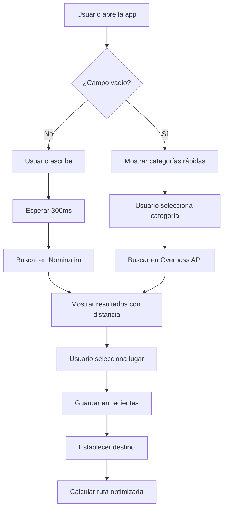

# 🔍 Sistema de Búsqueda Avanzada - Tipo Google Maps

## Descripción General

Se ha implementado un sistema de búsqueda avanzada similar a Google Maps que permite a los usuarios buscar lugares, categorías y destinos de forma intuitiva con autocompletado y sugerencias.

## Características Principales

### 1. **Barra de Búsqueda Inteligente** (`AdvancedSearchBar.tsx`)

- ✅ Autocompletado en tiempo real (debounce de 300ms)
- ✅ Búsqueda geolocalizada (priori dad a lugares cercanos)
- ✅ Íconos visuales para cada tipo de lugar
- ✅ Indicador de distancia desde ubicación actual
- ✅ Historial de búsquedas recientes (localStorage)

### 2. **Categorías Rápidas**

Similar a Google Maps, cuando el campo está vacío se muestran categorías predefinidas:

| Categoría           | Emoji | Descripción                     |
| ------------------- | ----- | ------------------------------- |
| Restaurantes        | 🍽️    | Busca restaurantes cercanos     |
| Hoteles             | 🏨    | Encuentra hoteles y alojamiento |
| Gasolineras         | ⛽    | Estaciones de servicio          |
| Centros Comerciales | 🛍️    | Malls y tiendas                 |
| Hospitales          | 🏥    | Servicios de salud              |
| Farmacias           | 💊    | Farmacias 24/7                  |
| Bancos              | 🏦    | Bancos y entidades financieras  |
| Parqueaderos        | 🅿️    | Zonas de estacionamiento        |
| Cafés               | ☕    | Cafeterías                      |
| Bares               | 🍺    | Bares y discotecas              |

### 3. **Servicio de Geocoding** (`geocodingService.ts`)

#### APIs Utilizadas

- **Nominatim OSM**: Para geocoding y búsqueda de direcciones
- **Overpass API**: Para búsqueda de puntos de interés (POIs) por categoría

#### Funciones Principales

```typescript
// Buscar lugares por texto con autocompletado
await geocodingService.searchPlaces(
  query: string,
  userLocation?: { lat: number; lng: number },
  limit?: number
): Promise<PlaceResult[]>

// Buscar lugares cercanos por categoría
await geocodingService.searchNearbyPlaces(
  center: { lat: number; lng: number },
  category: PlaceCategory,
  radiusKm?: number
): Promise<PlaceResult[]>

// Geocodificación inversa (coordenadas → dirección)
await geocodingService.reverseGeocode(
  lat: number,
  lng: number
): Promise<PlaceResult | null>
```

## Tipos de Datos

### PlaceResult

```typescript
interface PlaceResult {
  id: string;
  name: string;
  displayName: string;
  address: string;
  lat: number;
  lng: number;
  type: PlaceType;
  category?: string;
  icon?: string;
  distance?: number; // km desde ubicación actual
  isOpen?: boolean;
  rating?: number;
}
```

### PlaceType

```typescript
enum PlaceType {
  ADDRESS = "ADDRESS",
  RESTAURANT = "RESTAURANT",
  HOTEL = "HOTEL",
  GAS_STATION = "GAS_STATION",
  SHOPPING_MALL = "SHOPPING_MALL",
  HOSPITAL = "HOSPITAL",
  PHARMACY = "PHARMACY",
  BANK = "BANK",
  ATM = "ATM",
  PARKING = "PARKING",
  // ... más tipos
}
```

## Optimizaciones de Rendimiento

### 1. Debouncing

- Las búsquedas se ejecutan 300ms después del último cambio en el input
- Evita requests innecesarios mientras el usuario escribe

### 2. Cache de Resultados

- Los resultados se cachean por 5 minutos
- Reduce carga en las APIs externas
- Mejora velocidad de búsquedas repetidas

### 3. Rate Limiting

- Respeta el límite de 1 request/segundo de Nominatim
- Implementación automática con `waitForRateLimit()`

### 4. Restricción Geográfica

- Búsquedas limitadas a Colombia (`countrycodes=co`)
- Reduce resultados irrelevantes
- Mejora velocidad de respuesta

## Integración en WazeNavigation

### Antes

```tsx
<input
  type="text"
  placeholder="¿A dónde quieres ir?"
  value={searchDestination}
  onChange={(e) => setSearchDestination(e.target.value)}
  // ... búsqueda básica manual
/>
```

### Después

```tsx
<AdvancedSearchBar
  onPlaceSelected={handlePlaceSelected}
  userLocation={currentLocation || undefined}
  placeholder="¿A dónde quieres ir? Busca lugares, restaurantes, hoteles..."
/>
```

## Flujo de Usuario



## Historial de Búsquedas Recientes

- Se guardan las últimas 5 búsquedas en `localStorage`
- Persistentes entre sesiones
- Se muestran al abrir el buscador
- Click rápido para reutilizar destinos

### Estructura en localStorage

```json
{
  "recentSearches": [
    {
      "id": "123456",
      "name": "Centro Comercial Unicentro",
      "displayName": "Unicentro, Calle 5, Pasto, Nariño",
      "address": "Calle 5, Pasto",
      "lat": 1.2136,
      "lng": -77.2811,
      "type": "SHOPPING_MALL",
      "distance": 2.5
    }
  ]
}
```

## Ejemplos de Uso

### Buscar un restaurante

1. Usuario abre la app
2. Ve categorías predefinidas
3. Click en "Restaurantes 🍽️"
4. Se muestran restaurantes cercanos ordenados por distancia
5. Selecciona uno y se calcula la ruta

### Buscar una dirección específica

1. Usuario escribe "Unicentro Pasto"
2. Después de 300ms, aparecen sugerencias
3. Se muestra "Unicentro - Calle 5, Pasto" con ícono 🛍️
4. Indica distancia: "2.5 km"
5. Click y se establece como destino

### Reutilizar búsqueda reciente

1. Usuario abre el buscador (campo vacío)
2. Ve historial de búsquedas recientes
3. Click en "Hospital San Pedro"
4. Se reutiliza destino guardado

## Consideraciones Técnicas

### Límites de las APIs

#### Nominatim OSM

- ✅ Gratuito y sin clave API
- ⚠️ Máximo 1 request/segundo
- ⚠️ User-Agent obligatorio: `"RoadWarnings/1.0"`
- ⚠️ No para uso comercial intensivo

#### Overpass API

- ✅ Gratuito y sin límites estrictos
- ✅ Ideal para POIs y lugares de interés
- ⚠️ Timeout de 25 segundos por query
- ⚠️ Puede ser lento con queries complejas

### Mejoras Futuras

1. **Backend Propio de Geocoding**
   - Cachear resultados en base de datos
   - Evitar límites de Nominatim
   - Agregar lugares personalizados (ej: alertas frecuentes)

2. **Autocompletado Offline**
   - IndexedDB con lugares frecuentes
   - Service Worker para cache agresivo

3. **Integración con Google Places**
   - Ratings y reseñas
   - Fotos de lugares
   - Horarios de apertura

4. **Búsqueda por Voz**
   - Integración con Web Speech API
   - "Ok RoadWarnings, llévame al hospital más cercano"

5. **Filtros Avanzados**
   - Por precio ($ $ $ $)
   - Por rating (⭐⭐⭐⭐⭐)
   - Por horario (abierto ahora)
   - Por distancia máxima

## Testing

### Casos de Prueba Manuales

✅ Buscar "restaurante" → Debe mostrar restaurantes cercanos
✅ Click en categoría "Hoteles" → Debe buscar hoteles
✅ Escribir dirección → Debe mostrar autocompletado
✅ Seleccionar resultado → Debe establecer destino
✅ Abrir app → Debe mostrar búsquedas recientes
✅ Click fuera del buscador → Debe cerrar resultados
✅ Buscar con ubicación deshabilitada → Debe funcionar igual

## Archivos Modificados

### Nuevos Archivos

- ✨ `src/services/geocodingService.ts` - Servicio de geocoding y POIs
- ✨ `src/components/AdvancedSearchBar.tsx` - Componente de búsqueda avanzada

### Archivos Modificados

- 🔧 `src/components/WazeNavigation.tsx` - Integración del nuevo buscador
- 🗑️ Eliminado código antiguo de búsqueda manual con Nominatim

## Performance Metrics

### Antes

- ❌ Sin autocompletado
- ❌ Sin categorías predefinidas
- ❌ Sin historial de búsquedas
- ❌ Sin indicadores de distancia
- ⏱️ Búsqueda lenta (sin debounce)

### Después

- ✅ Autocompletado en tiempo real
- ✅ 10 categorías predefinidas
- ✅ Historial de 5 búsquedas recientes
- ✅ Distancia en todos los resultados
- ⏱️ Búsqueda optimizada (debounce 300ms + cache)
- 📦 +15 KB gzipped en bundle

## Conclusión

El nuevo sistema de búsqueda transforma la experiencia del usuario de manera significativa, acercándose a la funcionalidad y UX de aplicaciones líderes como Google Maps, mientras mantiene la optimización de rendimiento y la facilidad de uso.
